# Secure File Handling With PGP Encryption

Secure file handling is crucial for protecting sensitive information. This article explores a robust approach to file encryption, compression, and handling using Node.js.

PGP (Pretty Good Privacy) encryption is a widely used method for securing digital communications and files. It employs a combination of symmetric and asymmetric encryption to ensure data confidentiality and integrity. In PGP, data is encrypted with a public key and can only be decrypted by the corresponding private key, making it highly secure. It is commonly used for encrypting emails, files, and securing sensitive information. PGP's strength lies in its ability to ensure that only intended recipients can access the encrypted content.

## Overview

This project demonstrates a secure file handling system using Node.js. It includes modules for ZIP file compression, PGP encryption, and secure file handling.

```mermaid
graph TD
    subgraph fileProcessing["🏢 File Processing"]
        style fileProcessing fill:#e6f7ff,stroke:#4d94ff
        fileGeneration["📄 File Generation"]
        zipCreation["🗜️ ZIP Creation"]
        pgpEncryption["🔐 PGP Encryption"]
        
    end

    subgraph fileHandling["👥 File Handling"]
        style fileHandling fill:#e6ffe6,stroke:#4dff4d
        pgpDecryption["🔓 PGP Decryption"]
        zipExtraction["📂 ZIP Extraction"]
    end

    fileGeneration --> zipCreation
    zipCreation --> pgpEncryption
    pgpEncryption --> pgpDecryption
    pgpDecryption --> zipExtraction

    pgpPublicKey["🔑 PGP Public Key"]
    pgpPrivateKey["🗝️ PGP Private Key"]

    pgpPublicKey -->|"Used for encryption"| pgpEncryption
    pgpPrivateKey -->|"Used for decryption"| pgpDecryption
```    


## Run the project

```bash
node index.js
```

Output:

```bash
Output directory cleaned.
Keys loaded from disk.
ZIP file created: output/archive.zip
Encrypted file created: output/encrypted_archive.zip.gpg
Decrypted file created: output/decrypted_archive.zip
Files extracted to: output/extracted_files
Extracted files:
- test.txt
```


## Project Structure

Our secure file handling system is divided into three main files:

1. `zipUtils.js`: Handles ZIP file creation and extraction
2. `pgpUtils.js`: Manages PGP encryption and decryption
3. `index.js`: Orchestrates the entire process

## ZIP Utilities (zipUtils.js)

```javascript
const fs = require('fs');
const fsPromises = require('fs').promises;
const path = require('path');
const archiver = require('archiver');
const unzipper = require('unzipper');

// Function to create a ZIP file
async function createZip(files, outputZip) {
    await fsPromises.mkdir(path.dirname(outputZip), { recursive: true });
    return new Promise((resolve, reject) => {
        const output = fs.createWriteStream(outputZip);
        const archive = archiver('zip', { zlib: { level: 9 } });

        output.on('close', () => resolve(outputZip));
        archive.on('error', reject);
        archive.pipe(output);

        files.forEach(file => archive.file(file, { name: path.basename(file) }));
        archive.finalize();
    });
}

// Function to extract a ZIP file
async function extractZip(zipFile, outputDir) {
    await fsPromises.mkdir(outputDir, { recursive: true });
    return new Promise((resolve, reject) => {
        fs.createReadStream(zipFile)
            .pipe(unzipper.Extract({ path: outputDir }))
            .on('close', () => resolve(outputDir))
            .on('error', reject);
    });
}

module.exports = { createZip, extractZip };
```

This module provides two main functions:
- `createZip`: Compresses given files into a ZIP archive
- `extractZip`: Extracts contents of a ZIP file to a specified directory

These functions use the `archiver` and `unzipper` libraries to handle ZIP operations efficiently.

## PGP Utilities (pgpUtils.js)

```javascript
const fs = require('fs').promises;
const openpgp = require('openpgp');

async function encryptFile(inputFile, outputFile, publicKeyArmored) {
    const fileContent = await fs.readFile(inputFile);
    const publicKey = await openpgp.readKey({ armoredKey: publicKeyArmored });

    const encrypted = await openpgp.encrypt({
        message: await openpgp.createMessage({ binary: fileContent }),
        encryptionKeys: publicKey,
        format: 'binary'
    });

    await fs.writeFile(outputFile, encrypted);
    return outputFile;
}

async function decryptFile(inputFile, outputFile, privateKeyArmored, passphrase) {
    const encryptedData = await fs.readFile(inputFile);
    const privateKey = await openpgp.decryptKey({
        privateKey: await openpgp.readPrivateKey({ armoredKey: privateKeyArmored }),
        passphrase
    });

    const message = await openpgp.readMessage({ binaryMessage: encryptedData });
    const { data: decrypted } = await openpgp.decrypt({
        message,
        decryptionKeys: privateKey,
        format: 'binary'
    });

    await fs.writeFile(outputFile, decrypted);
    return outputFile;
}

module.exports = { encryptFile, decryptFile };
```

This module provides two essential functions:
- `encryptFile`: Encrypts a file using PGP public key encryption
- `decryptFile`: Decrypts a PGP-encrypted file using a private key and passphrase

These functions utilize the `openpgp` library to perform cryptographic operations.


## Main Process (index.js)

```javascript
const fsPromises = require('fs').promises;
const fs = require('fs');
const openpgp = require('openpgp');
const path = require('path');
const { createZip, extractZip } = require('./zipUtils');
const { encryptFile, decryptFile } = require('./pgpUtils');

async function cleanOutputDir(outputDir) {
    try {
        await fsPromises.rmdir(outputDir, { recursive: true });
        console.log('Output directory cleaned.');
    } catch (err) {
        if (err.code !== 'ENOENT') {
            throw err;
        }
    }
}

async function demonstrateSecureFileHandling() {
    try {
        const keysDir = './keys';
        const outputDir = './output';
        const inputFilePath = './input/test.txt';
        const privateKeyPath = path.join(keysDir, 'privateKey.asc');
        const publicKeyPath = path.join(keysDir, 'publicKey.asc');

        await cleanOutputDir(outputDir);
        await fsPromises.mkdir(keysDir, { recursive: true });

        let privateKey, publicKey;

        try {
            privateKey = await fsPromises.readFile(privateKeyPath, 'utf8');
            publicKey = await fsPromises.readFile(publicKeyPath, 'utf8');
            console.log('Keys loaded from disk.');
        } catch (err) {
            const keyPair = await openpgp.generateKey({
                type: 'rsa',
                rsaBits: 4096,
                userIDs: [{ name: 'Test User', email: 'test@example.com' }],
                passphrase: 'secure123'
            });
            privateKey = keyPair.privateKey;
            publicKey = keyPair.publicKey;

            await fsPromises.writeFile(privateKeyPath, privateKey);
            await fsPromises.writeFile(publicKeyPath, publicKey);
            console.log('Keys generated and saved to disk.');
        }

        const zipFile = await createZip([inputFilePath], path.join(outputDir, 'archive.zip'));
        console.log(`ZIP file created: ${zipFile}`);

        const encryptedFile = await encryptFile(zipFile, path.join(outputDir, 'encrypted_archive.zip.gpg'), publicKey);
        console.log(`Encrypted file created: ${encryptedFile}`);

        const decryptedFile = await decryptFile(encryptedFile, path.join(outputDir, 'decrypted_archive.zip'), privateKey, 'secure123');
        console.log(`Decrypted file created: ${decryptedFile}`);

        const extractionDir = path.join(outputDir, 'extracted_files');
        await extractZip(decryptedFile, extractionDir);
        console.log(`Files extracted to: ${extractionDir}`);

        const files = await fsPromises.readdir(extractionDir);
        console.log('Extracted files:');
        files.forEach(file => console.log(`- ${file}`));

    } catch (error) {
        console.error('An error occurred:', error.message);
    }
}

demonstrateSecureFileHandling();
```

This main script ties everything together and demonstrates the complete secure file handling process:

1. **Setup**: It creates necessary directories and manages PGP keys.
2. **Key Management**: It either loads existing PGP keys or generates new ones if not found.
3. **File Processing**:
   - Creates a ZIP archive of the input file
   - Encrypts the ZIP file using PGP
   - Decrypts the encrypted file
   - Extracts the contents of the decrypted ZIP file
4. **Verification**: Lists the extracted files to confirm successful processing

## Considerations

To use this system in a production environment, consider implementing additional security measures such as secure key storage, regular key rotation, and audit logging. Always follow best practices for handling sensitive data and stay updated with the latest security recommendations for the libraries used in this implementation.

It's important to note that this implementation focuses on demonstrating the process and may not include all necessary security measures for a production environment. Always consult with security experts and follow industry best practices when implementing cryptographic systems in real-world applications.
